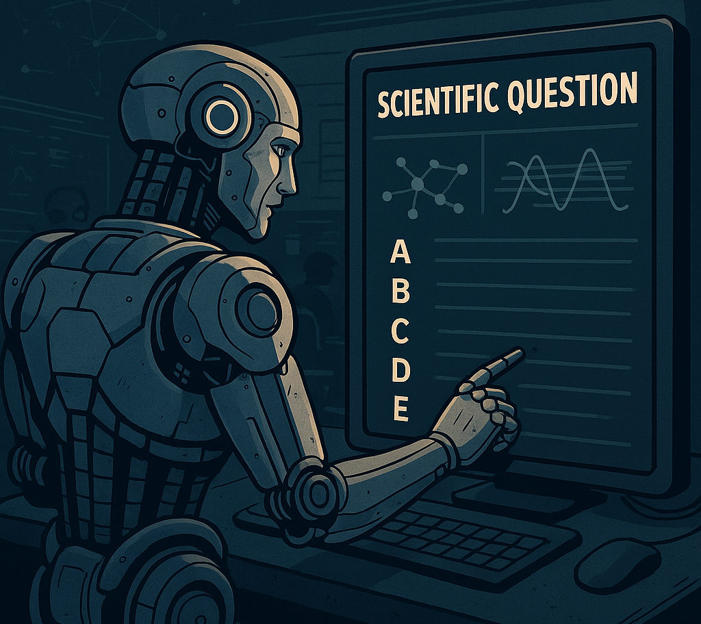

# Scenario: The Turing Apex Challenge

The year is 2050, and AI models now compete in the Turing Apex Challenge—a global tournament where only the most advanced AI survives. The world's top research teams train their models to tackle ultra-complex scientific problems with minimal human intervention.

Your Mission: Prepare an AI model to compete effectively in the challenge.

Task Details:
You will be given a training dataset consisting of 50 high-stakes scientific questions, each presented as a multiple-choice question with 5 options, along with their correct answers. Your goal is to develop and optimize an AI model capable of answering similar scientific questions accurately.

You should leverage in-context learning techniques. To enhance your model's accuracy, you must implement a Retrieval-Augmented Generation (RAG) approach, retrieving relevant information from external knowledge sources (like Wikipedia) to inform the model's answers. You will need to refine your prompts (prompt engineering) to guide the model effectively.

After developing your approach using the training data, your model will be tested on a new set of unseen scientific multiple-choice questions (test data) for which answers are not provided.

# Core Requirements:
1.  You MUST use an open-source Large Language Model (LLM).
2.  Your solution MUST include a Retrieval-Augmented Generation (RAG) component using external data (e.g., fetched from the internet).
3.  Your final code MUST be runnable within a Google Colab environment. Please ensure your submission is a Colab notebook (.ipynb)

